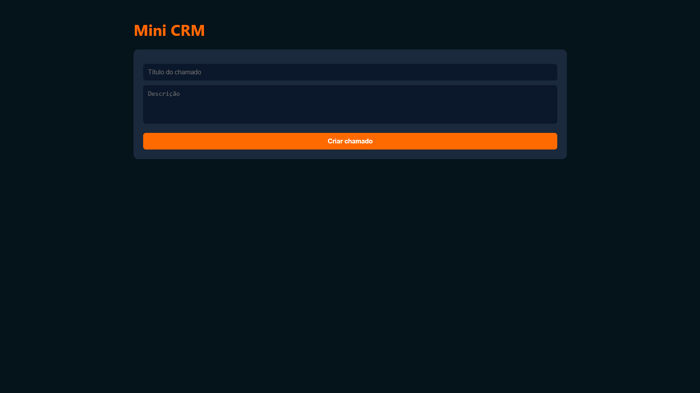

<h1 align="center">💼 Mini CRM — Sistema de Gestão de Chamados com JavaScript</h1>

<p align="center">
  O <strong>Mini CRM</strong> é uma aplicação web para gerenciamento de chamados de atendimento, desenvolvida com foco em lógica de sistemas, manipulação de estado e experiência do usuário.
</p>

<p align="center">
  Este projeto foi totalmente desenvolvido por mim, <strong>Jean Pedro</strong>.
</p>

<p align="center">
  
</p>

<p align="center">
  <a href="https://jjeanpedro03.github.io/mini-crm/" target="_blank">
    
  </a>
</p>

---

## 🎯 Objetivo

Este projeto foi desenvolvido com o objetivo de simular o funcionamento de um sistema real de atendimento (CRM), aplicando conceitos fundamentais de desenvolvimento front-end como manipulação de estado, eventos dinâmicos e persistência de dados.

---

## 🚀 Sobre o Projeto

O **Mini CRM** permite gerenciar chamados de forma simples e eficiente, simulando um fluxo real de atendimento:

- 📌 Abertura de chamados  
- 🔄 Atualização de status  
- ❌ Exclusão de registros  
- 💾 Persistência de dados no navegador  

A aplicação foi construída com foco em comportamento de sistemas reais, indo além de interfaces estáticas.

---

## 🛠️ Tecnologias Utilizadas

<p align="left">
  
</p>

- **HTML5:** Estrutura da aplicação  
- **CSS3:** Estilização com foco em layout de sistema (dashboard)  
- **JavaScript (Vanilla):** Lógica de negócio, manipulação de DOM e eventos  
- **LocalStorage:** Persistência de dados no navegador  
- **Git:** Versionamento do projeto  

---

## ⚙️ Funcionalidades

- **CRUD Completo:**
  - Criar chamados  
  - Listar chamados  
  - Atualizar status  
  - Excluir chamados  

- **Fluxo de Status Dinâmico:**
  - Aberto → Em andamento → Resolvido  

- **Persistência de Dados:**
  - Armazenamento no `localStorage`  
  - Dados mantidos mesmo após recarregar a página  

- **Interface Responsiva:**
  - Adaptada para desktop e dispositivos móveis  

- **Interação Dinâmica:**
  - Uso de Event Delegation para manipulação eficiente de eventos  

---

## 💡 Diferenciais Técnicos

- **Gerenciamento de Estado:** Uso de array como fonte de verdade da aplicação  
- **Event Delegation:** Manipulação de eventos em elementos dinâmicos  
- **Persistência Local:** Simulação de banco de dados com `localStorage`  
- **Arquitetura Simples e Escalável:** Separação clara entre lógica e interface  
- **UX Funcional:** Interface orientada a sistemas reais  

---

## 🧠 Conceitos Aplicados

- Manipulação de DOM  
- Eventos em JavaScript  
- Estruturas de dados (arrays e objetos)  
- CRUD (Create, Read, Update, Delete)  
- Persistência de dados no frontend  
- Responsividade com CSS  

---

## 📂 Estrutura de Pastas

```text
mini-crm/
│
├── css/
│   └── style.css
├── js/
│   └── script.js
├── img/
│   └── apresentacao.gif
└── index.html
```
